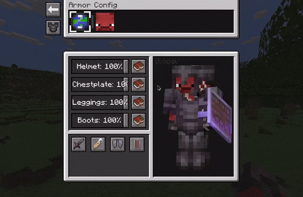
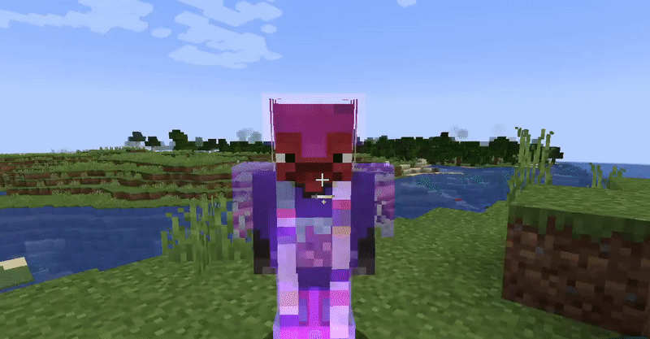
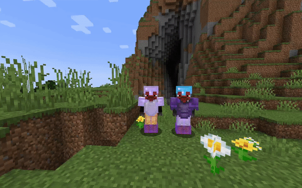

> [!WARNING]
> Like some of my other projects, this repository has been migrated to Codeberg.
> Any new issues or pull requests here will be ignored, please create them over at the new repository.
> 
> New repository:
> https://codeberg.org/enjarai/do-a-barrel-roll

# Show Me Your Skin!

Show Me Your Skin! (the exclamation mark is important) is a client-side mod with
optional server-side support that enables extensive customization of armor 
rendering. Every feature is toggleable and designed to be as flexible as possible.

## Sliders galore

All the armor hiding options you could ever need, in one intuitive GUI. 
Including:

- Individual configuration of each armor piece and elytra/shield:
  - Arbitrary transparency
  - Invisibility
  - Enchant glint hiding
- Server-based syncing of settings
- Player name tag display toggle
- Context-sensitive armor hiding
- Per-player settings overrides

## Truly flexible

Below are a few examples of the flexibility this mod offers. You can
fully cater the settings to your preference, and change them on the fly if needed.

## Context-sensitive hiding

Armor can be restored to vanilla behavior based on certain conditions, 
such as being in combat. This means the armor will be shown for a
configurable amount of seconds after a player is damaged.

## Multiplayer support

When the mod is installed on a server, it'll enter "server mode" and any settings 
you configure for yourself will be visible in real-time to other players. 
Though admins can enforce certain restrictions on what settings are available 
if they feel the need for it.

When the mod is only installed on your client however, you'll be able to
configure personal settings for every player on the server. Though these are
only visible to you.

