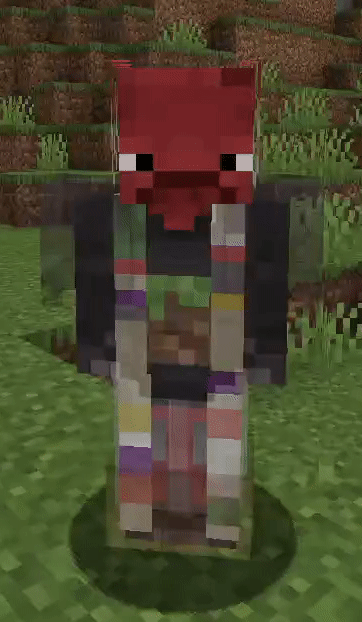

# Show Me Your Skin!

Show Me Your Skin! (the exclamation mark is important) is a client-side mod
that enables extensive customization of armor rendering. Every feature is toggleable
and designed to be as flexible as possible.

## Sliders galore

All the armor hiding options you could ever need, in one intuitive GUI. 
Including:

- Individual armor piece transparency/invisibility
- Elytra hiding
- Enchantment glint removal
- Player name tag display toggle
- Context-sensitive armor hiding
- Per-player settings overrides

## So many possibilities!

<table>
<tr>
    <th>Remove enchant glint</th>
    <th>Hide specific  armor pieces</th>
    <th>Add transparency</th>
    <th>Create an aura-like  effect by keeping the  enchant glint with low  armor transparency</th>
</tr>
<tr>
    <td></td>
    <td></td>
    <td></td>
    <td></td>
</tr>
</table>

## Context-sensitive hiding

Armor can be restored to vanilla behavior based on certain conditions, 
such as being in combat. This means the armor will be shown for a
configurable amount of seconds after a player is damaged.

## Per-player overrides

Override values per player in multiplayer, 
giving the vanilla social interactions screen an actual use!

